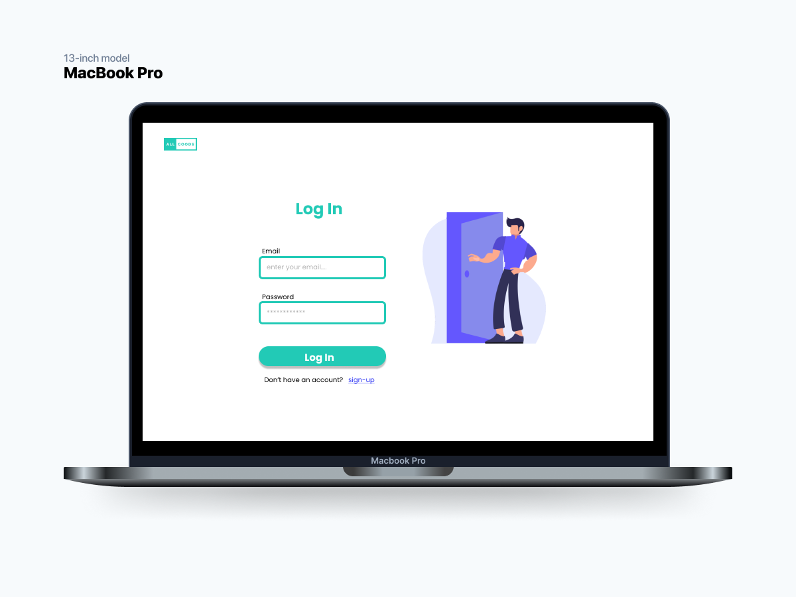

# ALL GOODS

The project is a e-commerce, where you can sell and buy the products you want or need.

Love a post? Drop a like! This is for the successor to ALL GOODS.

## Table Of Content

- [Features](#features)
- [Built with](#built-with)
- [Demo](#demo)
- [Future Improvements](#prototype)
- [Getting Started](#getting-started)
- [Prerequisites](#prerequisites)
- [Installation](#installation)
- [Usage](#usage)
- [Collaboration](#collaboration)
- [Backend](#backend)
- [Author](#author)


# 💫 Features

- Register & login
- Search Product
- Show product
- Add product
- Update product
- Delete product
- Buy product
- Payment product
- Show transaction
- Show profile
- Update profile
- Deactivate account

<br/>
<br/>


# 🛠️ Built With


<br/>
<br/>


# 🌎 Demo

Here is a working live demo - [Vercel](https://allgoods.vercel.app/)

  <br />
  <br />
  
  
  
# 🎨 Prototype


Here is the link for the UI design : [Figma](https://www.figma.com/file/ItToSoP9l0eW5PNaiqBQHb/Protoype-Grup-Project---Ecommerce?node-id=58%3A329&t=cjBmvMO8LZJgblSu-0)

<br/>
<br/>
<br/>


# Getting Started

This is an example of how you may give instructions on setting up your project locally.
To get a local copy up and running follow these simple example steps.

# Prerequisites

 npm
  ```sh
  npm install npm@latest -g
  ```

# Installation

1. Clone the repo
   ```sh
   git clone https://github.com/E-comerce-BE-FE.git
   ```
2. Install NPM packages
   ```sh
   npm install
   ```

# Usage

```sh
npm run dev
```


# 🤝 Collaboration

- [GitHub (Version Control System Platform)](https://github.com/E-comerce-BE-FE)
- [Discord](https://discord.com/)


# 🧰 Backend

- [Github Repository for the Backend team](https://github.com/E-comerce-BE-FE/ecommerce-app)
- [Swagger OpenAPI](https://app.swaggerhub.com/apis-docs/fauzilax/E-Commerce/1.0.0#/)


# 🤖 Author

- Qonik Fajriyah :

  [](https://github.com/fmqonik) 
- A. Zain Azharul Falah:

  [](https://github.com/zenzett) 

<h5>
<p align="center">Built with ❤️ by ALL GOODS ©️ 2023</p>
</h5>
